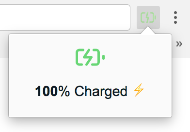
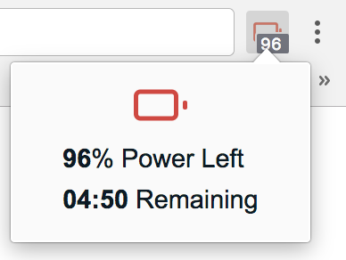

# Battery Info

<h1 align="center">
	
	 
	 
</h1>

> Check easily your laptop battery status.

## Description

The extension is using the [Battery Status API](https://developer.mozilla.org/en-US/docs/Web/API/Battery_Status_API).

Features:
- Shows current battery charge level as a badge on the icon (updates on every two minutes)
- Provides information about the remaining time / time until full charge (on icon click)
- Indicates with an icon whether or not the laptop is connected to a power adapter

It will be available on Chrome Web Store soon.
